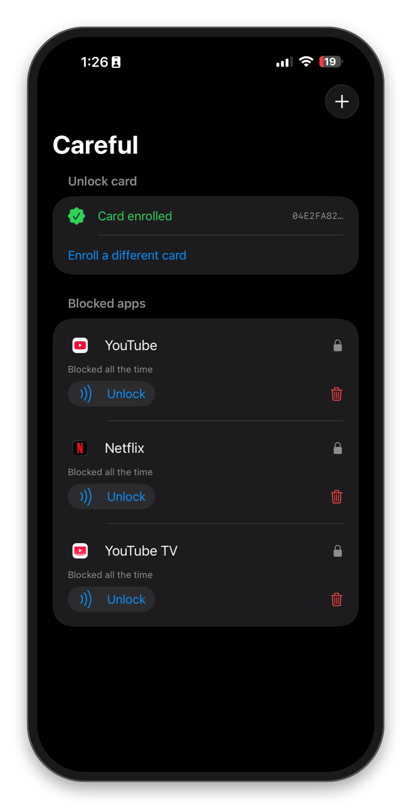
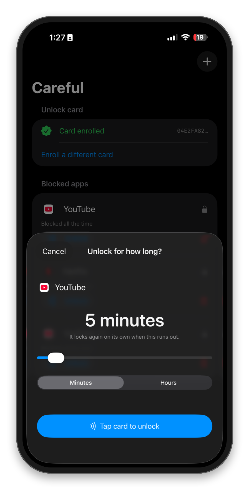
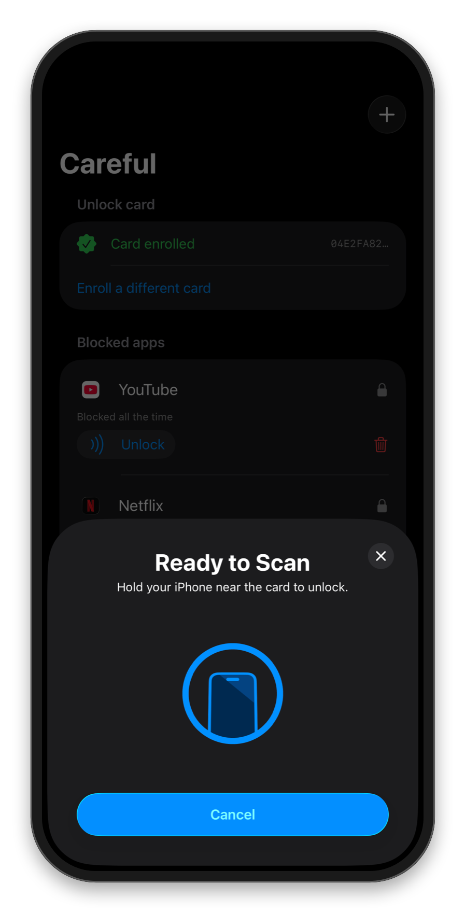

<p align="center">
  <picture>
    <source media="(prefers-color-scheme: dark)" srcset="docs/banner-dark.png">
    
  </picture>
</p>

<p align="center">
  <a href="#the-card">The card</a> ·
  <a href="#build-and-install">Build & install</a> ·
  <a href="#how-it-works">How it works</a> ·
  <a href="#ios-limitations">iOS limitations</a> ·
  <a href="https://github.com/alexanderjmontague/careful">Mac version</a>
</p>

---

Careful is a distraction blocker for iPhone that unlocks with an NFC card.

Your apps are blocked. When you need one, you open Careful, tap your card to the phone,
pick that one app, and choose how long — five minutes by default. When the time runs out it
locks again on its own. Nothing else gets unblocked in the process.

Removing an app from the list requires the card too.

<p align="center">
  
  
  
</p>

## The card

Any NFC card works:

- A **[Brick](https://getbrick.app)** or a **[Bloom card](https://bloom.inc)** you already
  own. Both are NFC tags that come with their own blocker apps. Enrolling one in Careful
  doesn't affect it, so it keeps working with the app it came with.
- Any other NFC tag — a blank NTAG sticker, a transit card, a hotel key, a conference
  badge. If the phone can read it, Careful can enroll it.

Careful reads the card's UID (the serial number burned in at the factory) and matches on
that. It never writes to the card. The card reader code has no write path.

A UID can be cloned with cheap hardware, so treat this as friction rather than security.

## Features

- Blocks apps, websites, and categories — anything Apple's picker offers. Blocked websites
  are blocked in Safari and in other apps' web views.
- Unlocks one item at a time, for a chosen duration, only with the card.
- Re-locks automatically when the time is up, whether or not you reopen Careful.
- Optional daily windows per item, with overlaps allowed.
- The block screen renders "Blocked" in Times New Roman. Apple's shield API doesn't allow
  custom fonts, but it does accept an image in the icon slot.

## Build and install

You need a paid Apple Developer account (Family Controls isn't available on free accounts),
an iPhone with NFC running iOS 17 or later, and [Tuist](https://tuist.dev).

```bash
git clone https://github.com/alexanderjmontague/careful-ios
cd careful-ios
tuist generate
```

Open `Careful.xcworkspace`, set your team under Signing & Capabilities for all three targets,
and run on your phone. The Family Controls development entitlement is granted automatically
to paid accounts. Only App Store distribution requires Apple's approval form.

On first launch, allow Screen Time access. If iOS reports that another app already has it,
go to **Settings → Screen Time → Apps With Screen Time Access**, remove the other app, and
try again. Only one app can hold this authorization.

### Bundle identifiers

The extension targets are named `…careful.FoqosDeviceMonitor` and
`…careful.FoqosShieldConfig`. Those App IDs already existed on the developer account with
the right capabilities, and `xcodebuild` can't register new ones without an interactive
Xcode session. Renaming them is a one-time change in the Signing pane.

## How it works

Three processes share one App Group:

| Target | Role |
|---|---|
| `Careful` | The app: UI, NFC, and all decisions. |
| `CarefulMonitor` | DeviceActivity extension. iOS wakes it at schedule boundaries; it recomputes everything from shared state. |
| `CarefulShield` | Draws the block screen. |

**One `ManagedSettingsStore` per item.** Apple allows up to 50 named stores, each with its
own shield set, and they combine. Giving each blocked item its own store means unlocking one
is just clearing that store.

**Blocked is the default state.** Shields persist through reboots and even app deletion.
Careful only has to change state, not maintain it.

**Recompute rather than trust callbacks.** iOS's schedule callbacks don't always fire (there
are open reports of `intervalDidStart` never being called). Careful recomputes every item's
correct state whenever it comes to the foreground and at every monitor boundary, so a
missed callback is corrected quickly.

**Short unlocks.** DeviceActivity won't schedule an interval under 15 minutes, which would
leave a 5-minute unlock with no re-lock timer. Careful back-dates the interval's start so it
spans 15 minutes but ends at the right time. A start in the past fires immediately, and
reconciling is idempotent, so nothing breaks.

## iOS limitations

- **The block screen can't open your app.** Shield buttons can only dismiss. So unlocking
  starts from inside Careful, not from the shield.
- **App tokens are opaque.** You never get a bundle ID, just a token from Apple's picker.
  `Label(token)` renders the real name and icon. Tokens have been reported to change
  occasionally.
- **50 tokens per store**, beyond which the store silently shields nothing. Careful uses one
  item per store and caps at 50 items.
- **Screen Time access can be revoked** by the user in Settings, and there's no passcode
  lock for third-party apps. Careful detects this and shows a warning.
- **Nothing works in the simulator.** Screen Time authorization is device-only, so the app
  skips the request under `targetEnvironment(simulator)`.

## Layout

```
Project.swift            Tuist manifest: three targets, entitlements, Info.plist keys
Shared/                  Model and blocker, compiled into both the app and the monitor
Careful/Sources/         App entry, UI, NFC card reader
CarefulMonitor/          DeviceActivity extension
CarefulShield/           Shield configuration extension
```

Xcode project files are generated and git-ignored. `tuist generate` recreates them.

## Mac version

[Careful for Mac](https://github.com/alexanderjmontague/careful) works the same way, except
there's no card — you unlock one thing by writing a reason for it.

## Credits

The extension setup was worked out by studying [foqos](https://github.com/awaseem/foqos)
(MIT). Careful started as a fork of it and was rebuilt from scratch.

MIT license. Copyright © 2026 Alexander Montague.
